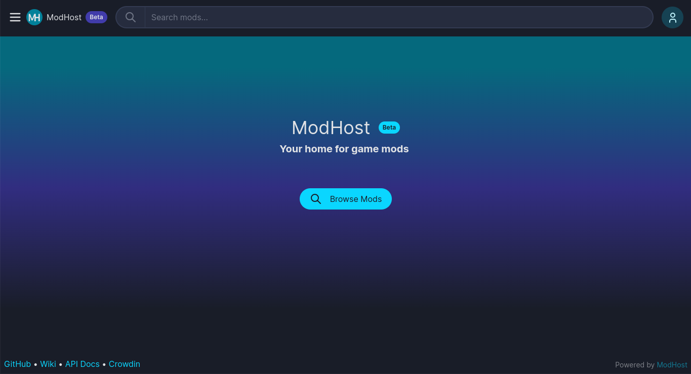

    

# ModHost

A simple, open-source, and self-hostable place to host mods for any game!

## Why ModHost?

There are a lot of reasons to choose ModHost! Here are just a few:

- [x] Fast, modern UI
- [x] Useful and blazingly fast full-text search
- [x] Useful search filters
- [x] Fully documented API
- [x] Easy to self-host
- [x] Simple customization
- [x] Highly configurable
- [x] Flexible
- [x] 100% open-source
- [x] Super secure
- [x] Built with trusted & tested technologies
- [x] Supports almost any game
- [x] Well-documented code

## Logo?

Yeah, the logo is a BIG work-in-progress. If you have a better one or concept, feel free to let me know!

## What happened to the CLI?

I made the decision to remove ModHost's CLI as it's no longer in scope for the project.
Due to the complexity of managing multiple different mod formats and installation methods,
I felt it would be best to leave that up to whoever is deploying it, as the API library is
solid enough and it's relatively easy to make one in most languages.
